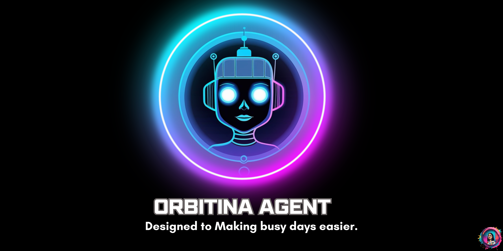

# AI Agents Platform – Frontend Technical Assessment

# Orbitina AI Agents Dashboard

Frontend technical assessment built with Next.js, React and TypeScript.

## Live Demo

Production deployment available on Vercel:

https://orbitina-dashboard.vercel.app/login

## Repository

https://github.com/Karolart/Orbitina-Dashboard

Frontend application built with **React + Next.js (App Router) + TypeScript** for a senior frontend technical assessment.

The project implements a **scalable dashboard** designed to manage and generate large volumes of AI agents while maintaining performance, traceability, and a clean modular architecture.

---

# Overview

In a near-future scenario, a platform can generate **AI agents at massive scale** to solve problems across multiple domains such as education, productivity, finance, and household tasks.

This application provides a **control panel** where users can:

* manage configuration resources
* generate large batches of AI agents
* explore and filter generated agents
* inspect and edit agent configurations
* track generation executions for traceability

The main challenge of this project is to **support exponential growth of generated agents** while maintaining performance and usability.

---

# Tech Stack

Core stack:

* **Next.js (App Router)**
* **React**
* **TypeScript**

State & data:

* **Zustand** – lightweight global state
* **Server / Client component separation**

Forms & validation:

* **React Hook Form**
* **Zod**

UI:

* **TailwindCSS**
* **Framer Motion**
* **Lucide Icons**

---

# Application Structure

The project follows a **feature-based architecture**, isolating domain logic by module rather than by file type.

```
src
│
├── app
│   ├── login
│   └── app
│       ├── agents
│       ├── generator
│       ├── resources
│       └── generations
│
├── features
│   ├── agents
│   ├── generations
│   ├── resources
│   └── auth
│
├── components
│   └── ui
│
├── lib
│
└── services
```

Benefits:

* clearer separation of concerns
* scalable architecture
* easier testing and maintenance

---

# Implemented Features

## Authentication & Protected Routes

Routes are separated between **public and protected sections**:

```
/login
/app/*
```

Session is persisted using **local storage** and validated during navigation.

Protected routes are handled through route guards to prevent unauthorized access.

---

# Resource Catalog Module

Users can manage base resources used for agent generation.

Examples include:

* categories
* tags
* agent templates
* configuration rules

Features:

* searchable list
* basic filters
* creation and edit forms
* form validation

---

# Bulk Agent Generation

The **Generator view** allows users to create multiple agents at once.

Users can configure:

* number of agents (N)
* category
* tags
* templates
* optional seed for reproducibility

Execution includes:

* loading state
* success/failure handling
* retry option
* summary of generated agents

Results include links to the agent detail view.

---

# Agents Listing

The `/app/agents` page provides exploration of generated agents.

Features:

* pagination
* filters
* sorting
* text search

The UI is designed to handle **large datasets efficiently**.

Strategies include:

* controlled pagination
* memoization
* optimized rendering

---

# Agent Detail & Editing

The `/app/agents/[id]` page displays detailed information about an agent.

Users can:

* inspect agent configuration
* edit configurable attributes
* save updates

Updates use **optimistic UI patterns or cache invalidation** for responsive interaction.

---

# Generation Runs & Traceability

The `/app/generations` page tracks bulk generation executions.

Each generation run includes:

* timestamp
* parameters used
* number of generated agents
* execution status
* link to generated results

This enables traceability and monitoring of generation activity.

---

# Performance Considerations

The application was designed with scalability in mind.

Key strategies include:

* pagination for large datasets
* memoized components
* separation of server and client components
* minimized unnecessary renders

These techniques ensure the interface remains responsive even with high data volumes.

---

# Error Handling

Consistent error management is implemented across the application.

Handled states include:

* loading
* empty
* success
* error

Errors are presented to users via UI feedback such as banners or notifications.

---

# Getting Started

Clone the repository:

```
git clone https://github.com/yourusername/ai-agents-platform.git
```

Install dependencies:

```
npm install
```

Run the development server:

```
npm run dev
```

Application runs at:

```
http://localhost:3000
```

---

# Environment Variables

If environment variables are required:

```
NEXT_PUBLIC_API_URL=
```

---

# Testing the Application

Recommended flow to test the application:

1. Login from `/login`
2. Navigate to `/app/resources` to create base resources
3. Go to `/app/generator` and generate agents
4. Inspect generated agents at `/app/agents`
5. Open an agent detail page and edit attributes
6. Check generation history at `/app/generations`

---

# Technical Decisions

Some architectural decisions made in this project:

Feature-based architecture
Improves scalability and isolates domain logic.

Zustand for state management
Chosen for its minimal boilerplate and predictable global state.

React Hook Form + Zod
Provides strong validation with good performance.

Next.js App Router
Allows clear separation between server and client components.

---

# Possible Future Improvements

* API integration with real backend services
* database persistence
* advanced search and filtering
* server-side caching
* telemetry and error tracking
* automated testing

---

# Author

Project developed as part of a **Senior Frontend Developer technical assessment**.

The main goal was to demonstrate:

* scalable frontend architecture
* performance-aware UI design
* robust state management
* maintainable TypeScript code
